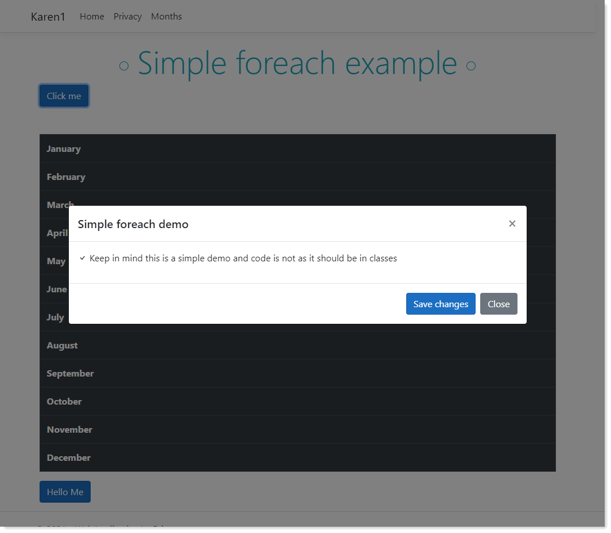

# About

Simple ASP.NET Core 5 code samples for teaching. Currently in a half-baked state. Still figuring a few things out as I'm use to using [Telerik DevCraft](https://www.telerik.com/devcraft).

DevCraft makes common and complex operations easy. Below are a few things to check out

- [Modal dialog](https://demos.telerik.com/aspnet-mvc/dialog)
- [DataSource](https://docs.telerik.com/aspnet-mvc/html-helpers/datasource/overview)
- [Grid](https://demos.telerik.com/aspnet-mvc/grid)
- Editors
  - [TextBox](https://docs.telerik.com/aspnet-mvc/html-helpers/editors/textbox/overview?_ga=2.40510818.1507964975.1632393318-314093328.1602601286)
  - [CheckBoxGroup](https://docs.telerik.com/aspnet-mvc/html-helpers/editors/checkboxgroup/overview)
- [Forms](https://demos.telerik.com/aspnet-mvc/form)
  - [Validation](https://demos.telerik.com/aspnet-mvc/form/validation)
  - [Orientation](https://demos.telerik.com/aspnet-mvc/form/orientation#)

I have a full license to DevCraft with a good deal of code samples. Have asked and rec'd a qoute for purchasing this framework.

This is the framework used at Oregon Department of Revenue.
 

## Important

After cloning this repository get the following NuGet packages if there are issues as I didn't included them in this repository.

- [bootstrap](https://www.nuget.org/packages/bootstrap/)
- [jQuery](https://www.nuget.org/packages/jQuery/)

